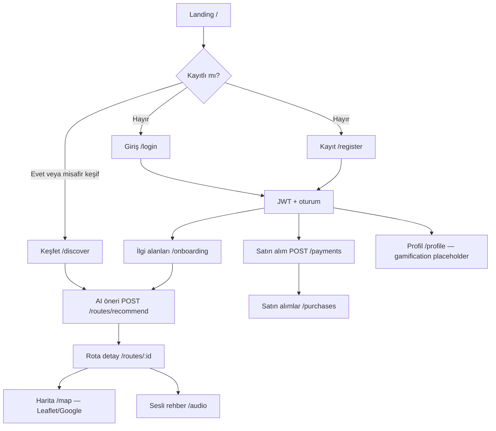
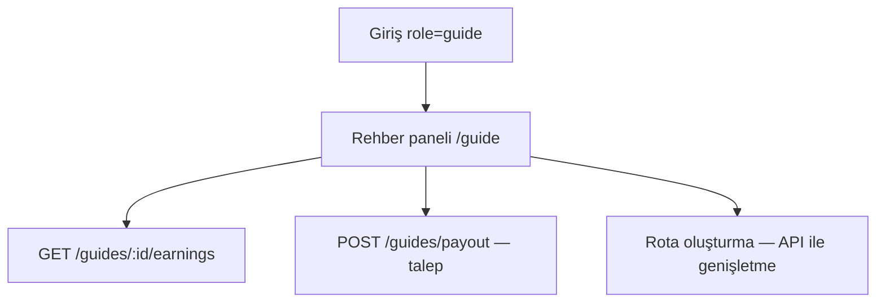

# Historial-GO — Kullanıcı akışı (User flow)

Hedef kitle: **İstanbul’da keşif yapan turistler (B2C)**, **dijital rota satan rehberler (B2B)** ve ileride **iş ortakları**. Akışlar, mevcut FastAPI + JWT + rotalar/stops/payments API’leriyle hizalıdır.

---

## 1. Durumlar (global)

| Durum | Açıklama |
|--------|-----------|
| `anon` | Token yok; landing, giriş, kayıt, keşif/harita/onboarding (public) |
| `auth_tourist` | JWT var; profil, satın alımlar; AI öneri kişisel parametrelerle |
| `auth_guide` | JWT + `role=guide`; rehber paneli + gelir uçları |

---

## 2. Turist (B2C) — ana mutlu yol

**API eşlemesi (takılmadan):**

- `POST /auth/register` → JWT + otomatik `GET /auth/me`
- `POST /auth/login` → JWT
- `GET /routes` + `POST /routes/recommend` → Keşfet
- `GET /routes/:id`, `GET /routes/:id/stops` → Detay
- `POST /payments` → checkout sonrası (UI’da “yakında” ile Stripe bağlanabilir)
- `GET /payments`, `GET /payments/users/:id` → Satın alımlar listesi

---

## 3. Rehber (B2B)

---

## 4. Koruma ve yönlendirme mantığı

| Rota | Koşul |
|------|--------|
| `/purchases`, `/profile`, `/guide` | `ProtectedRoute`: JWT yoksa → `/login` |
| `/login` başarılı | `replace` → `/discover` veya kayıt sonrası `/onboarding` |
| Token süresi / 401 | Oturum temizleme + `/login` (layout içi senkron) |

---

## 5. Kişiselleştirme (AI)

1. Onboarding store: ilgi alanları, süre, bütçe (istemci).
2. Keşfet: TanStack Query ile `GET /routes`; mutation ile `POST /routes/recommend`.
3. Sonuç: önerilen liste veya tam liste; harita pinleri demo konumlarla (`route_id` deterministik).

---

## 6. Düşük ışık / gece UX

- **Tema:** sistem / açık / koyu (`ThemeToggle`, `html.dark`).
- Kontrast: koyu zeminde amber/gold vurgu; gövde metni slate tonları.

Bu doküman, ekran wireframe’leri ile birlikte `docs/ux/WIREFRAMES.md` dosyasında somutlaştırılmıştır.
